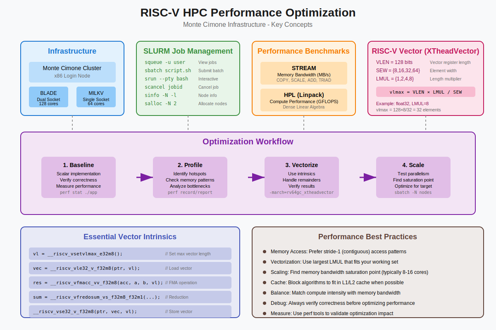

# Performance Optimization on RISC-V HPC Systems: A Practical Guide

## ACM Europe Summer School on HPC Computer Architectures for AI and Dedicated Applications

### Based on materials by: Andrea Bartolini, Giacomo Madella, Emanuele Venieri
### Department of Electrical, Electronic, and Information Engineering "Guglielmo Marconi"

---

## Table of Contents

1. [Introduction](#introduction)
2. [Monte Cimone Infrastructure Overview](#monte-cimone-infrastructure-overview)
3. [Getting Started with SLURM](#getting-started-with-slurm)
4. [Performance Benchmarking](#performance-benchmarking)
5. [RISC-V Vector Programming](#risc-v-vector-programming)
6. [Hands-on Exercises](#hands-on-exercises)
7. [Best Practices and Tips](#best-practices-and-tips)
8. [Conclusion](#conclusion)

---



## Introduction

This tutorial provides a comprehensive guide to performance optimization on RISC-V HPC systems, specifically focusing on the Monte Cimone infrastructure. Learners will explore how to:

- Navigate and utilize a RISC-V-based HPC cluster
- Run performance benchmarks to understand system capabilities
- Leverage RISC-V vector extensions for computational efficiency
- Optimize code using intrinsic functions

### Why RISC-V for HPC?

RISC-V represents a paradigm shift in processor architecture:
- **Open-source ISA**: Enables innovation and customization
- **Scalability**: From embedded systems to HPC applications
- **Energy efficiency**: Critical for sustainable computing
- **Vector extensions**: Native support for data-parallel operations

---

## Monte Cimone Infrastructure Overview

Monte Cimone is a cutting-edge RISC-V HPC cluster featuring two types of nodes:

### System Architecture

```
Monte Cimone Login (x86 machine)
         |
    SLURM Master
         |
    +---------+----------+
    |                    |
BLADE Partition     MILKV Partition
(E4 RSV10)         (Milk-V Pioneer)
Dual Socket        Single Socket
```

### Hardware Specifications

| Component | BLADE Nodes | MILKV Nodes |
|-----------|-------------|-------------|
| Architecture | RISC-V | RISC-V |
| Sockets | 2 | 1 |
| Max Cores | 128 | 64 |
| Vector Support | XTheadVector | XTheadVector |
| Vector Length | 128 bits | 128 bits |

### Connecting to Monte Cimone

To access the cluster, SSH (Secure Shell) protocol is used. The connection requires a specific port number (2223) and an assigned username.

**Windows users**: PowerShell, Command Prompt, or PuTTY can be used
```bash
ssh -p 2223 acm-hpc-XX@delta.dei.unibo.it
```

**Linux/Mac users**: The Terminal application is used
```bash
ssh -p 2223 acm-hpc-XX@delta.dei.unibo.it
```

**Tips**:
- XX should be replaced with the assigned user number (00-69)
- The `-p 2223` flag specifies the non-standard SSH port
- A password prompt will appear (provided by instructors)
- If a host key verification message appears, "yes" should be typed to continue

**First-time setup**: After logging in, the password should be changed for security
```bash
yppasswd
```
This command updates the password in the Yellow Pages (NIS) system used by the cluster.

---

## Getting Started with SLURM

SLURM (Simple Linux Utility for Resource Management) orchestrates job scheduling on the cluster.

### Essential SLURM Commands

**View job queue**: Check the status of submitted jobs
```bash
squeue -u <username>
```
**Tips**: 
- Shows job ID, partition, name, user, state, time, and nodes
- States include: PD (pending), R (running), CG (completing)
- `-l` can be added for long format with more details

**Check cluster status**: View information about available nodes and partitions
```bash
sinfo -N -l
```
**Tips**:
- `-N` shows node-oriented view
- `-l` provides detailed information including memory, CPUs, and state
- "idle" nodes should be identified when planning large jobs

## Example output
```bash
acm-hpc-11@mcimone-login$ ~ sinfo -N -l
Fri Jul 25 14:18:37 2025
NODELIST    NODES PARTITION       STATE CPUS    S:C:T MEMORY TMP_DISK WEIGHT AVAIL_FE REASON                     
mc-blade-1      1    blade*        idle 128   1:128:1 256000        0      1   (null) none                       
mc-blade-2      1    blade*        idle 128   1:128:1 256000        0      1   (null) none                       
mc-blade-3      1    blade*        idle 128   1:128:1 256000        0      1   (null) none                       
mc-blade-4      1    blade*        idle 128   1:128:1 256000        0      1   (null) none                       
mc-milkv-1      1     milkv        idle 64     1:64:1 128000        0      1   (null) none                       
mc-milkv-2      1     milkv        idle 64     1:64:1 128000        0      1   (null) none                       
mc-milkv-3      1     milkv        idle 64     1:64:1 128000        0      1   (null) none  
```

**Submit a batch job**: Queue a job script for later execution
```bash
sbatch <job_script>
```
**Tips**:
- Returns a job ID for tracking
- Script must be executable (`chmod +x script.sh`)
- Output goes to `slurm-<jobid>.out` unless specified otherwise

**Run an interactive job**: Get immediate access to compute nodes
```bash
srun -N 1 --ntasks-per-node=1 --pty /bin/bash -l
```
**Tips**:
- `-N 1` requests one node
- `--pty` allocates a pseudo-terminal for interactive use
- `-l` ensures login shell with proper environment
- Exit with `exit` or Ctrl+D

**Cancel a job**: Remove a job from the queue or stop a running job
```bash
scancel <job_id>
```
**Tips**:
- `squeue -u $USER` can be used to find job IDs
- Multiple jobs can be cancelled: `scancel job1 job2 job3`
- No confirmation prompt appears - caution is advised

**Allocate resources**: Reserve nodes for multiple commands
```bash
salloc -N 2 --ntasks-per-node=4 -t 01:00:00
```
**Tips**:
- Creates a shell with allocated resources
- Multiple `srun` commands can be run within this allocation
- Exit with `exit` or Ctrl+D to release resources
- Useful for iterative development and testing

### Interactive Jobs with SRUN

**Run on default partition**: Quick access to blade nodes for testing
```bash
srun -N 1 --ntasks-per-node=1 --pty /bin/bash -l
```
**Tips**:
- Default partition is "blade" (dual-socket nodes)
- Ideal for initial code testing and debugging
- Job starts immediately if resources are available

**Run on RISC-V partition**: Access to Milk-V Pioneer nodes
```bash
srun -N 1 --ntasks-per-node=1 -p milkv --pty /bin/bash -l
```
**Tips**:
- `-p milkv` specifies the RISC-V partition
- Single-socket nodes with 64 cores maximum
- Better for production runs of RISC-V optimized code

**Request multiple cores**: For parallel testing
```bash
srun -N 1 --ntasks-per-node=8 -p milkv --pty /bin/bash -l
```
**Tips**:
- `--ntasks-per-node` should be adjusted based on parallel needs
- Maximum: 128 for blade, 64 for milkv
- `nproc` can be used inside the job to verify allocated cores

### Batch Jobs with SBATCH

A job script defines resource requirements and commands to execute. Here's a complete example:

**Create the script file** (saved as `myjob.sh`):
```bash
#!/usr/bin/bash
#SBATCH --job-name=mytest
#SBATCH --output=job.out
#SBATCH --error=job.err
#SBATCH --nodes=1
#SBATCH --ntasks-per-node=4
#SBATCH --mem=1GB
#SBATCH --partition=milkv
#SBATCH --time=00:30:00

echo "Job started on $(hostname)"
echo "Running with $SLURM_NTASKS tasks"

# Application commands go here
srun ./my_application
```

**Key SBATCH directives explained**:
- `--job-name`: Identifies the job in queue listings
- `--output/--error`: Redirect stdout/stderr to files (default: slurm-%j.out)
- `--nodes`: Number of compute nodes needed
- `--ntasks-per-node`: Processes per node (consider cores available)
- `--mem`: Memory per node (use MB, GB units)
- `--partition`: Target specific node types
- `--time`: Maximum runtime (format: HH:MM:SS)

**Make the script executable**:
```bash
chmod +x myjob.sh
```

**Submit the job**:
```bash
sbatch myjob.sh
```
**Tips**:
- Returns immediately with "Submitted batch job <jobid>"
- The job ID can be used to track progress with `squeue`
- Output files should be checked after completion

**Monitor job progress**:
```bash
squeue -j <jobid>
```

**View job output while running**:
```bash
tail -f job.out
```
**Tips**:
- `-f` follows the file as it grows
- Ctrl+C stops following
- Works for both stdout and stderr files

---

## Performance Benchmarking

Understanding system performance characteristics is crucial for optimization. We'll use two industry-standard benchmarks:

### STREAM: Memory Bandwidth Benchmark

STREAM measures sustainable memory bandwidth and corresponding computation rates for vector operations.

#### What STREAM Measures

| Operation | Kernel | Bytes/Iteration | FLOPS/Iteration |
|-----------|--------|-----------------|-----------------|
| COPY | a[i] = b[i] | 16 | 0 |
| SCALE | a[i] = q*b[i] | 16 | 1 |
| ADD | a[i] = b[i] + c[i] | 24 | 1 |
| TRIAD | a[i] = b[i] + q*c[i] | 24 | 2 |

#### Running STREAM

**Navigate to the exercise directory**:
```bash
cd ~/mc-hands-on/ex1
```

**Submit the STREAM benchmark job**:
```bash
sbatch ./stream.sh
```
**Tips**:
- The script is pre-configured with basic settings
- Job output will appear in `logs/stream.out`
- Takes 1-2 minutes depending on configuration

**Modify core count for scaling tests**: Edit the script before submitting
```bash
nano stream.sh
```
The line `#SBATCH --ntasks-per-node=X` should be found and X changed to test different core counts (1, 2, 4, 8, 16, 32, 64).

**Tips**:
- Save with Ctrl+O, exit with Ctrl+X in nano
- Powers of 2 should be tested for clear scaling patterns
- Other parameters should remain constant for valid comparison

**Check job status**:
```bash
squeue -u $USER
```

**View results after completion**:
```bash
cat logs/stream.out
```
**Tips**:
- The "TRIAD" bandwidth is most representative
- Results are in MB/s (megabytes per second)
- Higher values indicate better performance, but saturation should be watched for

#### Analyzing Results

A simple scaling analysis can be created by collecting results:

**Extract bandwidth values**:
```bash
grep "Triad:" logs/stream.out | awk '{print $2}'
```

**Tips for analysis**:
- Bandwidth (y-axis) vs. core count (x-axis) should be plotted
- Bandwidth should increase then plateau
- The saturation point indicates memory controller limits
- Typical saturation occurs at 8-16 cores on modern systems

### HPL: High-Performance Linpack

HPL solves dense linear systems and measures floating-point performance (FLOPS).

#### Running HPL

**Navigate to the exercise directory**:
```bash
cd ~/mc-hands-on/ex1
```

**Run single-core HPL test**:
```bash
sbatch ./hpl_1c.sh
```
**Tips**:
- Establishes baseline performance
- Results in `logs/hpl_1c.out`
- Takes 5-10 minutes for small problem sizes

**Run four-core HPL test**:
```bash
sbatch ./hpl_4c.sh
```
**Tips**:
- Tests parallel scaling efficiency
- Compare with single-core results
- Look for near-linear scaling (4x performance)

**Monitor job progress** (HPL jobs can take time):
```bash
squeue -u $USER -i 10
```
**Tips**:
- `-i 10` auto-refreshes every 10 seconds
- Check "TIME" column for runtime
- Press Ctrl+C to stop monitoring

**Check results after completion**:
```bash
cat logs/hpl_1c.out | grep "Gflops"
```
```bash
cat logs/hpl_4c.out | grep "Gflops"
```

**Tips for result interpretation**:
- Gflops = Billion floating-point operations per second
- Theoretical peak = cores × frequency × operations_per_cycle
- 70-80% of peak is excellent efficiency
- Lower efficiency may indicate memory bottlenecks

**Advanced: Custom HPL configuration** (optional):
```bash
cp bin/HPL_64c.dat bin/HPL.dat
```
Then edit `bin/HPL.dat` to adjust:
- Problem size (N): Larger uses more memory but is more efficient
- Block size (NB): Typically 192-256 for best performance
- Process grid (P,Q): Should multiply to core count

**Submit custom configuration**:
```bash
sbatch ./hpl_custom.sh
```
**Warning**: Large problem sizes can run for hours!

---

## RISC-V Vector Programming

The RISC-V Vector (RVV) extension provides data-parallel processing capabilities essential for HPC workloads.

### XTheadVector Extension

Monte Cimone's SG2042 processors implement XTheadVector, based on RVV 0.7.1:

- **Vector Length (VLEN)**: 128 bits
- **Supported Element Widths (SEW)**: 8, 16, 32, 64 bits
- **Length Multiplier (LMUL)**: 1, 2, 4, 8

### Key Vector Concepts

```
vlmax = VLEN × LMUL / SEW
```

Example calculations:
- For 32-bit floats with LMUL=8: vlmax = 128 × 8 / 32 = 32 elements
- For 64-bit doubles with LMUL=4: vlmax = 128 × 4 / 64 = 8 elements

### Vector Data Types

Format: `v[type][SEW]m[LMUL]_t`

Examples:
- `vfloat32m8_t`: Vector of 32-bit floats using 8 registers
- `vuint8m1_t`: Vector of 8-bit unsigned integers using 1 register

### Configuration
**Set vector length to maximum** for 32-bit floats with LMUL=8:
```c
size_t vl = __riscv_vsetvlmax_e32m8();
```
**Tips**: 
- Returns the maximum elements that fit in vector registers
- For SG2042: vl = 128×8/32 = 32 elements
- Call once outside loops when possible

**Set specific vector length** for remainder handling:
```c
size_t vl = __riscv_vsetvl_e32m8(avl);
```
**Tips**:
- `avl` = application vector length (elements needed)
- Returns min(avl, vlmax)
- Use in loops to handle partial vectors

### Load/Store Operations
**Load vector from memory**:
```c
vfloat32m8_t vec = __riscv_vle32_v_f32m8(ptr, vl);
```
**Tips**:
- `ptr` must be valid for `vl` elements
- No alignment requirements (but aligned is faster)
- Memory faults if accessing beyond allocated memory

**Store vector to memory**:
```c
__riscv_vse32_v_f32m8(ptr, vec, vl);
```
**Tips**:
- Stores `vl` elements from `vec` to memory at `ptr`
- Partial stores possible with smaller `vl`
- Use for writing results back

### Arithmetic Operations
**Vector addition**:
```c
vfloat32m8_t c = __riscv_vfadd_vv_f32m8(a, b, vl);
```
**Tips**:
- Element-wise: c[i] = a[i] + b[i]
- All inputs must use same `vl`
- No in-place operations (c can equal a or b though)

**Fused multiply-accumulate** (most important for performance):
```c
vfloat32m8_t d = __riscv_vfmacc_vv_f32m8(acc, a, b, vl);
```
**Tips**:
- Computes: d = acc + (a × b)
- Single instruction, higher precision
- Critical for dot products and matrix operations

### Reductions
**Sum reduction** to scalar:
```c
vfloat32m1_t sum = __riscv_vfredosum_vs_f32m8_f32m1(
    zero, vec, zero, vl);
```
**Tips**:
- Reduces m8 vector to m1 vector (single element)
- First `zero` is destination (usually unused)
- Second `zero` is initial accumulator value
- Order matters for floating-point accuracy

### Example: Vectorized Dot Product

```c
float vectorized_dotp(int n, float *x, float *y) {
    size_t vl;
    vfloat32m8_t vx, vy, vsum;
    vfloat32m1_t vzero, vres;
    
    // Initialize accumulator
    vzero = __riscv_vfmv_v_f_f32m1(0.0f, 1);
    vsum = __riscv_vfmv_v_f_f32m8(0.0f, __riscv_vsetvlmax_e32m8());
    
    // Main loop
    for (size_t i = 0; i < n; i += vl) {
        vl = __riscv_vsetvl_e32m8(n - i);
        
        // Load vectors
        vx = __riscv_vle32_v_f32m8(&x[i], vl);
        vy = __riscv_vle32_v_f32m8(&y[i], vl);
        
        // Multiply-accumulate
        vsum = __riscv_vfmacc_vv_f32m8(vsum, vx, vy, vl);
    }
    
    // Reduce to scalar
    vres = __riscv_vfredosum_vs_f32m8_f32m1(vzero, vsum, vzero, 
           __riscv_vsetvlmax_e32m8());
    
    return __riscv_vfmv_f_s_f32m1_f32(vres);
}
```

---

## Hands-on Exercises

### Exercise 1: Memory Bandwidth Analysis

**Objective**: Determine memory bandwidth characteristics of the system.

**Step 1 - Navigate to exercise directory**:
```bash
cd ~/mc-hands-on/ex1
```

**Step 2 - Create a test script** for systematic testing:
```bash
cp stream.sh stream_test.sh
```

**Step 3 - Edit the script** to test specific core counts:
```bash
nano stream_test.sh
```
The line `#SBATCH --ntasks-per-node=X` should be changed where X is the test value.

**Recommended test sequence**: 1, 2, 4, 8, 16, 32, 64 cores

**Step 4 - Run tests** for each core count:
```bash
sbatch stream_test.sh
```
**Tips**:
- Each job should complete before modifying for the next test
- Output files should be renamed to preserve results: `mv logs/stream.out logs/stream_Xcore.out`

**Step 5 - Collect all results**:
```bash
grep "Triad:" logs/stream_*core.out | sort -V
```

**Step 6 - Analyze saturation point**:
```bash
for f in logs/stream_*core.out; do 
    echo -n "$(basename $f): "
    grep "Triad:" $f | awk '{print $2}'
done
```

**Expected Insights**:
- Memory bandwidth typically saturates at 8-16 cores
- Bandwidth per core decreases as core count increases
- Understanding saturation helps optimize parallel applications
- Fewer cores than the saturation point should be used for memory-bound applications

### Exercise 2: Computational Performance Scaling

**Objective**: Analyze floating-point performance scaling.

**Step 1 - Run baseline single-core test**:
```bash
sbatch ./hpl_1c.sh
```

**Step 2 - Run multi-core test**:
```bash
sbatch ./hpl_4c.sh
```

**Step 3 - Wait for completion** and check status:
```bash
watch -n 5 'squeue -u $USER'
```
**Tips**: 
- Press Ctrl+C to exit watch
- Both jobs should show state "CG" or disappear when done

**Step 4 - Extract performance results**:
```bash
grep "Gflops" logs/hpl_1c.out
```
```bash
grep "Gflops" logs/hpl_4c.out
```

**Step 5 - Calculate scaling efficiency**:
If 1-core gives X Gflops and 4-core gives Y Gflops:
- Ideal scaling: Y = 4 × X
- Actual efficiency = (Y / X) / 4 × 100%

**Advanced testing - Create custom configuration**:
```bash
cp bin/HPL_64c.dat bin/HPL.dat
```

**Edit HPL parameters**:
```bash
nano bin/HPL.dat
```
Key parameters to modify:
- Line with problem size (N): Try 10000, 20000, 30000
- Line with block size (NB): Keep at 192 or 256
- Process grid P and Q: Must multiply to core count

**Create a custom submission script**:
```bash
cp hpl_4c.sh hpl_custom.sh
nano hpl_custom.sh
```
Modify `--ntasks-per-node` to match your P×Q value.

**Submit custom test**:
```bash
sbatch ./hpl_custom.sh
```
**Warning**: Larger problem sizes increase runtime significantly!

### Exercise 3: Vector Programming

**Objective**: Implement matrix-vector multiplication using intrinsics.

**Step 1 - Load the compiler module**:
```bash
module load gcc-14.2.0
```
**Tips**: 
- This loads GCC 14.2 with RISC-V vector support
- `module list` can be used to verify it's loaded
- Required for XTheadVector intrinsics

**Step 2 - Navigate to exercise directory**:
```bash
cd ~/mc-hands-on/ex2
```

**Step 3 - Study the dot product example**:
```bash
cat dotp.c
```
**Tips**:
- `golden_dotp()` is the reference implementation
- `intrinsics_dotp()` is the vectorized version
- The intrinsic function patterns should be noted

**Step 4 - Compile the dot product example**:
```bash
gcc dotp.c -O3 -march=rv64gc_xtheadvector -o dotp
```
**Flags explained**:
- `-O3`: Maximum optimization level
- `-march=rv64gc_xtheadvector`: Enable RISC-V with XTheadVector
- `-o dotp`: Output executable name

**Step 5 - Run with performance monitoring**:
```bash
perf stat ./dotp
```
**Tips**:
- "cycles" between scalar and vector versions should be compared
- Reduced instruction count should be observed in vector version
- "branches" should be significantly lower

**Step 6 - Open the matrix-vector exercise**:
```bash
nano matvec.c
```

**Step 7 - Implement the vectorized version**:
```c
void intrinsics_matvec(int m, int n, float *A, 
                       float *x, float *y) {
    // Hint: Each row should be processed with vector operations
    // The dot product pattern from dotp.c should be used
    // Remember: A is row-major, size m×n
}
```

**Implementation tips**:
- Outer loop iterates over rows (m iterations)
- Inner loop uses vector operations similar to dot product
- Each row of A multiplied by vector x produces one element of y
- Remainder elements must be handled

**Step 8 - Compile the implementation**:
```bash
gcc matvec.c -O3 -march=rv64gc_xtheadvector -o matvec
```

**Step 9 - Test the implementation**:
```bash
./matvec
```
**Success indicators**:
- "Results match!" message appears
- Performance improvement over scalar version is shown
- No segmentation faults occur

**Step 10 - Verify vectorization**:
```bash
objdump -d matvec | grep -E "vle|vse|vfmacc" | head -20
```
**Tips**:
- Vector load (vle), store (vse), and arithmetic instructions should appear
- If empty, vectorization may have failed
- Compiler warnings should be checked for hints

---

## Best Practices and Tips

### 1. Memory Access Patterns

- **Stride-1 access**: Contiguous memory access should always be preferred
- **Cache blocking**: Computations should be tiled to fit in cache
- **Prefetching**: RISC-V supports software prefetch hints

### 2. Vector Programming Guidelines

- **Maximize vector length**: The largest LMUL that fits the data should be used
- **Minimize vector configuration changes**: Similar operations should be grouped
- **Consider alignment**: Aligned loads/stores perform faster

### 3. Performance Analysis

**Basic performance statistics**:
```bash
perf stat -e cycles,instructions,cache-misses ./application
```
**Tips**:
- `cycles`: Total CPU cycles (lower values indicate better performance)
- `instructions`: Total instructions executed
- `cache-misses`: Memory access efficiency indicator
- IPC (instructions/cycle) > 1 indicates good performance

**Check if code is vectorized**:
```bash
objdump -d application | grep -E "v[ls]e|vf"
```
**Tips**:
- `vle*/vse*`: Vector load/store instructions
- `vf*`: Vector floating-point operations
- No output indicates no vectorization detected
- `| head -50` can be used to see first occurrences

**Profile with detailed events**:
```bash
perf record ./application
perf report
```
**Navigation tips**:
- Arrow keys navigate the interface
- Enter drills down into functions
- 'q' quits the report
- Hotspots (high percentage functions) should be identified

### 4. Debugging Tips

- Start with scalar implementation
- Correctness should be verified before optimizing
- Small problem sizes facilitate debugging
- Results should be compared with golden reference

### 5. Resource Utilization

- Job status should be monitored with `squeue` and `sinfo`
- Only needed resources should be requested
- Appropriate partition (blade vs milkv) should be selected
- Job arrays can be considered for parameter sweeps

---

## Conclusion

This tutorial covered essential aspects of RISC-V HPC programming:

1. **Infrastructure**: Understanding Monte Cimone's architecture
2. **Job Management**: Effective use of SLURM
3. **Performance Analysis**: Benchmarking with STREAM and HPL
4. **Vector Programming**: Leveraging RISC-V vector extensions
5. **Optimization**: Best practices for HPC applications

### Key Takeaways

- RISC-V offers compelling advantages for HPC workloads
- Vector extensions provide significant performance benefits
- Understanding system characteristics guides optimization
- Proper resource management ensures efficient cluster usage

### Further Reading

- [RISC-V Vector Extension Specification](https://github.com/riscv/riscv-v-spec)
- [XTheadVector Documentation](https://github.com/XUANTIE-RV/thead-extension-spec)
- [STREAM Benchmark](https://www.cs.virginia.edu/stream/)
- [HPL Benchmark](https://www.netlib.org/benchmark/hpl/)

### Contact

- Andrea Bartolini: a.bartolini@unibo.it
- Giacomo Madella: giacomo.madella@unibo.it
- Emanuele Venieri: emanuele.venieri2@unibo.it

Department of Electrical, Electronic, and Information Engineering "Guglielmo Marconi"  
Viale del Risorgimento, 2 Bologna  
[www.unibo.it](http://www.unibo.it)

---

**Remember**: Performance optimization is an iterative process. Start with working code, measure systematically, and optimize based on evidence. Happy computing on RISC-V!
