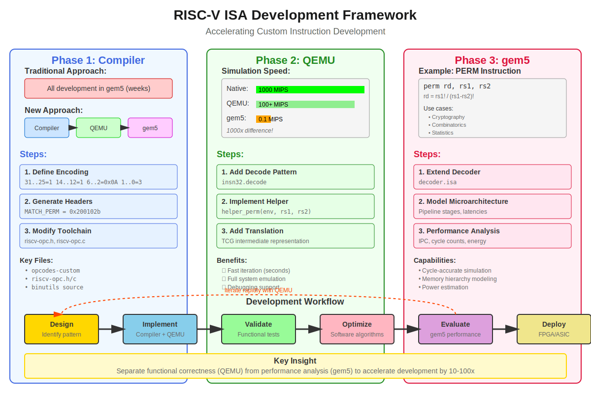
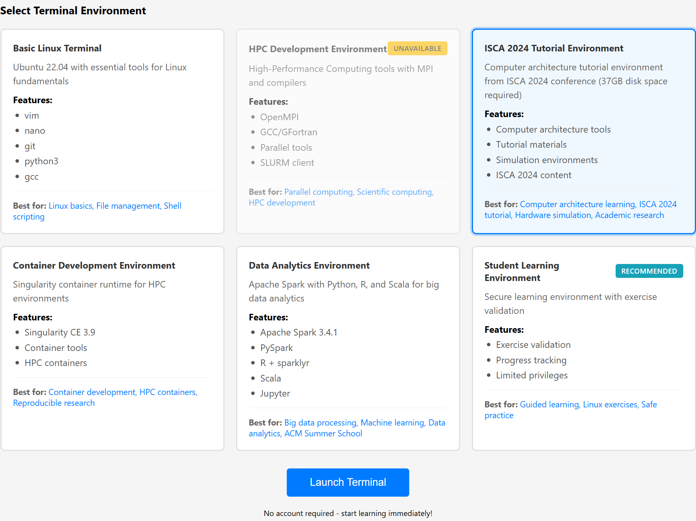

# RISC-V ISA Development Framework: A Comprehensive Tutorial

## Expedited Development of Novel RISC-V Instructions Through an Emulation-Simulation Framework

**Original Authors:** Ivan Vargas-Valdivieso, Carlos Rojas Morales, Julian Pavon, Nishil Talati and Adrian Cristal  
**Tutorial Prepared for:** ACM Europe Summer School on HPC Computer Architectures for AI and Dedicated Applications

---



## Table of Contents

1. [Introduction and Motivation](#introduction-and-motivation)
2. [Background: Why Custom Instructions Matter](#background-why-custom-instructions-matter)
3. [The RISC-V Advantage](#the-risc-v-advantage)
4. [Development Framework Overview](#development-framework-overview)
5. [Prerequisites and Setup](#prerequisites-and-setup)
6. [Example: Implementing a Permutation Instruction](#example-implementing-a-permutation-instruction)
7. [Phase 1: Compiler Extension](#phase-1-compiler-extension)
8. [Phase 2: QEMU Emulation](#phase-2-qemu-emulation)
9. [Phase 3: Gem5 Performance Simulation](#phase-3-gem5-performance-simulation)
10. [Testing and Validation Strategies](#testing-and-validation-strategies)
11. [Performance Analysis and Optimization](#performance-analysis-and-optimization)
12. [Case Studies and Applications](#case-studies-and-applications)
13. [Advanced Topics and Future Directions](#advanced-topics-and-future-directions)

---

## Introduction and Motivation

### The Evolution of Computer Architecture

Modern computer architecture faces an inflection point. Moore's Law is slowing, Dennard scaling has ended, and general-purpose processors struggle to meet the performance and energy efficiency demands of emerging workloads. The solution? **Domain-specific architectures** (DSAs) that tailor hardware to specific application domains.

### Learning Objectives

By the end of this tutorial, students will:
- Understand the complete workflow for ISA extension development
- Master the tools needed to prototype custom instructions
- Appreciate the trade-offs between simulation accuracy and speed
- Gain hands-on experience with industry-standard tools
- Develop intuition for when custom instructions provide value

---

## Background: Why Custom Instructions Matter

### The Specialization Trend

Consider the computational requirements of modern applications:

| Application Domain | Computational Pattern | Potential Custom Instructions |
|-------------------|----------------------|------------------------------|
| **AI/ML** | Matrix multiplication, convolution | Matrix multiply-accumulate, tensor operations |
| **Cryptography** | Bit manipulation, finite field arithmetic | AES rounds, SHA acceleration |
| **Genomics** | String matching, edit distance | Sequence alignment, pattern matching |
| **Databases** | Predicate evaluation, hashing | String comparison, bloom filters |
| **Graph Analytics** | Pointer chasing, atomic updates | Prefetch hints, atomic min/max |

### Real-World Impact

Industry has already embraced this approach:
- **Intel AMX**: Up to 8× speedup for AI inference
- **ARM SVE**: 2-4× improvement in HPC workloads  
- **RISC-V Vector**: 10-100× speedup for data-parallel tasks

### The Research Opportunity

While industry focuses on broad extensions, researchers can explore:
- Ultra-specialized instructions for niche domains
- Novel computational primitives
- Energy-optimized operations
- Application-specific accelerators

---

## The RISC-V Advantage

### Architectural Philosophy

RISC-V embodies key principles that facilitate experimentation:

1. **Simplicity**: Base ISA has only 47 instructions
2. **Modularity**: Clear separation of concerns
   ```
   Base ISA (RV32I/RV64I) + Standard Extensions (M,A,F,D,C,V...) + Custom Extensions
   ```
3. **Extensibility**: Reserved opcode space for experimentation

### The Opcode Map

RISC-V reserves four major opcodes for custom use:

```
custom-0: opcode = 0001011 (0x0B)
custom-1: opcode = 0101011 (0x2B) 
custom-2: opcode = 1011011 (0x5B)
custom-3: opcode = 1111011 (0x7B)
```

Each provides space for hundreds of instruction variants using different function fields.

### Instruction Encoding Formats

RISC-V defines six basic formats:

```
R-type: [ funct7 | rs2 | rs1 | funct3 | rd | opcode ]
         31    25 24  20 19  15 14   12 11 7 6      0

I-type: [ imm[11:0] | rs1 | funct3 | rd | opcode ]

S-type: [ imm[11:5] | rs2 | rs1 | funct3 | imm[4:0] | opcode ]

... (B-type, U-type, J-type)
```

Understanding these formats is crucial for instruction design.

---

## Development Framework Overview

### The Challenge: Simulation Speed vs. Accuracy

Traditional architectural simulators face a fundamental trade-off:

| Simulator Type | Speed | Accuracy | Use Case |
|---------------|-------|----------|----------|
| **Functional** | Very Fast (100+ MIPS) | No timing | Correctness testing |
| **Cycle-approximate** | Fast (1-10 MIPS) | Approximate | Design exploration |
| **Cycle-accurate** | Slow (0.01-0.1 MIPS) | Detailed | Performance validation |

### The Solution: A Hybrid Approach

The framework leverages each tool's strengths:

```
Stage 1: Compiler Integration (Minutes)
├── Define instruction encoding
├── Extend assembler/disassembler  
└── Enable code generation

Stage 2: QEMU Functional Testing (Seconds per test)
├── Implement instruction semantics
├── Validate correctness
└── Debug software algorithms

Stage 3: Gem5 Performance Analysis (Hours)
├── Model microarchitectural behavior
├── Measure performance impact
└── Evaluate hardware complexity
```

### Key Insight: Separate Concerns

- **Correctness** is independent of timing → Use fast functional simulation
- **Performance** requires detailed modeling → Use only for final evaluation
- **Software development** needs rapid iteration → Compiler support essential

---

## Prerequisites and Setup

### Required Background Knowledge

Students should be familiar with:
- Computer architecture fundamentals (pipelines, caches, etc.)
- C/C++ programming
- Basic assembly language concepts
- Linux command line

### Tool Stack Overview

#### 1. RISC-V GNU Toolchain
- **Purpose**: Compile C/C++ to RISC-V binaries
- **Components**: gcc, binutils, gdb
- **Modification needed**: Add instruction to assembler

#### 2. riscv-opcodes
- **Purpose**: Generate instruction encodings automatically
- **Input**: Human-readable instruction description
- **Output**: C headers with masks and match patterns

#### 3. QEMU
- **Purpose**: Fast functional emulation
- **Architecture**: Dynamic binary translation
- **Performance**: Near-native speed for user-mode emulation

#### 4. gem5
- **Purpose**: Detailed microarchitectural simulation
- **Features**: Configurable CPU models, memory system, peripherals
- **Trade-off**: 1000-10000× slower than native execution

### Environment Setup

#### Using the web-based terminal (Available for ACM Summer School Students for one week):
[https://leap.hpc-ignite.org](https://leap.hpc-ignite.org)

Select "Terminal Center" and launch the ISCA 2024 terminal.



Go to the working directory of this tutorial
```bash
cd /home
```

#### Using the provided Docker image on local machine (recommended):

```bash
# Pull the pre-configured environment
$ docker pull isabenders/isca24-tutorial:latest

# Start interactive session
$ docker run -it isabenders/isca24-tutorial:latest
```

Manual setup requires building each tool from source - see appendix for details.

---

## Example: Implementing a Permutation Instruction

### Instruction Design Process

Let's implement a permutation instruction that computes P(n,r) = n!/(n-r)!

#### Step 1: Identify the Computation Pattern

Permutations appear in:
- Combinatorial algorithms
- Cryptographic key generation  
- Statistical sampling
- Graph algorithms (path counting)

#### Step 2: Analyze Implementation Options

Current implementation requires:
```c
int permutation(int n, int r) {
    int result = 1;
    for (int i = 0; i < r; i++) {
        result *= (n - i);
    }
    return result;
}
// Approximately 3 + 4*r instructions
```

Custom instruction reduces this to 1 instruction!

#### Step 3: Define Instruction Semantics

```
Instruction: PERM rd, rs1, rs2
Operation:   rd = rs1! / (rs1 - rs2)!
Format:      R-type
Encoding:    custom-1 opcode space
```

#### Step 4: Consider Hardware Implementation

Hardware options:
- Lookup table for small values
- Iterative multiplier for larger values
- Hybrid approach with early termination

---

## Phase 1: Compiler Extension

### Understanding the Toolchain Flow

```
Source Code (.c) → Compiler → Assembly (.s) → Assembler → Object (.o) → Linker → Binary
                                    ↑
                          Our modifications here
```

### Step 1.1: Generate Instruction Encoding

The `riscv-opcodes` tool automates encoding generation:

```bash
cd riscv-opcodes
```
```bash
vim opcodes-custom
```

Add instruction definition:
```
# Permutation instruction
# Format: perm rd, rs1, rs2
perm rd rs1 rs2 31..25=1 14..12=1 6..2=0x0A 1..0=3
```

Breaking down the encoding:
- `31..25=1`: funct7 field = 0000001
- `14..12=1`: funct3 field = 001  
- `6..2=0x0A`: custom-1 opcode (binary: 01010)
- `1..0=3`: standard 32-bit instruction marker

Generate headers:
```bash
make
```
```bash
grep -n "perm" encoding.out.h
```

Output:
```c
#define MATCH_PERM 0x200102b
#define MASK_PERM  0xfe00707f
```

### Understanding Masks and Matches

The MATCH value represents the fixed bits:
```
MATCH_PERM = 0x200102b = 0000001 00000 00000 001 00000 0101011
              funct7 = 1 ----^      ^--- funct3 = 1     ^--- custom-1
```

The MASK identifies which bits to check:
```
MASK_PERM = 0xfe00707f = 1111111 00000 00000 111 00000 1111111
                          Check funct7   Check funct3   Check opcode
```

### Step 1.2: Modify GNU Binutils

Navigate to the toolchain:
```bash
cd ../riscv-gnu-toolchain
```

Four files need modification:

#### 1. Header files (riscv-opc.h)

Add to `binutils/include/opcode/riscv-opc.h`:
```c
/* Permutation instruction */
#define MATCH_PERM 0x200102b
#define MASK_PERM  0xfe00707f
...
DECLARE_INSN(perm, MATCH_PERM, MASK_PERM)
```

#### 2. Opcode tables (riscv-opc.c)

Add to `binutils/opcodes/riscv-opc.c`:
```c
/* name,    xlen, isa,          operands,     match,      mask,       match_func,    pinfo */
{"perm",    0,    INSN_CLASS_I, "d,s,t",      MATCH_PERM, MASK_PERM,  match_opcode,  0},
```

Field explanations:
- `"d,s,t"`: Operand format (dest, src1, src2)
- `INSN_CLASS_I`: Integer instruction class
- `match_opcode`: Standard matching function

### Step 1.3: Rebuild Toolchain

```bash
$ cd build
$ make -j$(nproc)
```

### Step 1.4: Test Assembly

Create test file:
```asm
.text
.global _start
_start:
    li a0, 10      # n = 10
    li a1, 3       # r = 3
    perm a2, a0, a1 # a2 = 10!/(10-3)! = 720
```

Assemble and verify:
```bash
$ riscv64-unknown-linux-gnu-as test.s -o test.o
$ riscv64-unknown-linux-gnu-objdump -d test.o
```

---

## Phase 2: QEMU Emulation

### QEMU Architecture Overview

QEMU uses dynamic binary translation:

```
Guest RISC-V Instructions → Decode → Translate to TCG → Optimize → Host Instructions
                               ↑
                     Our modifications here
```

TCG (Tiny Code Generator) is QEMU's intermediate representation.

### Step 2.1: Understanding QEMU Structure

Navigate to RISC-V target:
```bash
$ cd qemu/target/riscv/
```

Key files:
- `instmap.h`: Instruction encoding definitions
- `insn32.decode`: Decodetree specification
- `helper.h`: Helper function declarations
- `insn_trans/trans_rvi.c.inc`: Translation functions
- `op_helper.c`: Helper implementations

### Step 2.2: Add Instruction Definition

Edit `instmap.h`:
```c
/* Permutation instruction */
#define MATCH_PERM 0x200102b
#define MASK_PERM  0xfe00707f
```

### Step 2.3: Define Decode Pattern

Edit `insn32.decode`:
```
# Permutation instruction
# Format: perm rd, rs1, rs2
perm     .......  ..... ..... ... ..... ....... @r
```

The decodetree format uses pattern matching:
- `.` matches any bit
- Actual bits must match exactly
- `@r` references R-type format definition

### Step 2.4: Declare Helper Function

Edit `helper.h`:
```c
DEF_HELPER_3(perm, tl, env, tl, tl)
```

Parameters:
- Return type: `tl` (target long)
- Arguments: `env` (CPU state), two `tl` inputs

### Step 2.5: Implement Translation

Edit `insn_trans/trans_rvi.c.inc`:
```c
static bool trans_perm(DisasContext *ctx, arg_perm *a)
{
    REQUIRE_EXT(ctx, RVI);  // Require base integer extension
    
    TCGv dest = dest_gpr(ctx, a->rd);
    TCGv src1 = get_gpr(ctx, a->rs1, EXT_NONE);
    TCGv src2 = get_gpr(ctx, a->rs2, EXT_NONE);
    
    gen_helper_perm(dest, cpu_env, src1, src2);
    gen_set_gpr(ctx, a->rd, dest);
    
    return true;
}
```

### Step 2.6: Implement Helper Function

Create `perm_helper.c`:
```c
target_ulong helper_perm(CPURISCVState *env, target_ulong n, target_ulong r)
{
    // Input validation
    if (n < r || n > 20) {  // Prevent overflow
        return 0;
    }
    
    // Efficient implementation using falling factorial
    target_ulong result = 1;
    for (target_ulong i = n; i > n - r; i--) {
        result *= i;
    }
    
    return result;
}
```

### Step 2.7: Build and Test

```bash
$ cd ../../..
$ ./configure --target-list=riscv64-linux-user
$ make -j$(nproc)

# Test with a simple program
$ cat > test_perm.c << EOF
#include <stdio.h>
int main() {
    long result;
    asm volatile("perm %0, %1, %2" : "=r"(result) : "r"(10L), "r"(3L));
    printf("P(10,3) = %ld (expected 720)\n", result);
    return 0;
}
EOF

$ riscv64-unknown-linux-gnu-gcc -static test_perm.c -o test_perm
$ ./qemu-riscv64 test_perm
P(10,3) = 720 (expected 720)
```

---

## Phase 3: Gem5 Performance Simulation

### Gem5 Architecture

Gem5 models the complete microarchitecture:

```
Instruction Fetch → Decode → Rename → Issue → Execute → Writeback → Commit
                      ↑
              Our modifications here
```

### Step 3.1: ISA Description Files

Navigate to RISC-V ISA:
```bash
$ cd gem5/src/arch/riscv/isa
```

Key files:
- `bitfields.isa`: Instruction field definitions
- `decoder.isa`: Decode logic and semantics
- `formats/`: Instruction format templates

### Step 3.2: Define Bitfields

Edit `bitfields.isa` if custom fields needed:
```
// Standard R-type fields already defined
def bitfield FUNCT7 <31:25>;
def bitfield FUNCT3 <14:12>;
```

### Step 3.3: Add Decoder Entry

Edit `decoder.isa`:
```python
decode QUADRANT default Unknown::unknown() {
    0x3: decode OPCODE {
        // ...
        0x0a: decode FUNCT3 {  // custom-1 space
            0x1: decode FUNCT7 {
                0x01: Perm::perm({{
                    // Implement permutation logic
                    if (Rs1 < Rs2 || Rs1 > 20) {
                        Rd = 0;
                    } else {
                        uint64_t result = 1;
                        for (uint64_t i = Rs1; i > Rs1 - Rs2; i--) {
                            result *= i;
                        }
                        Rd = result;
                    }
                }}, IntAluOp);
            }
        }
    }
}
```

### Step 3.4: Define Execution Characteristics

For detailed modeling, specify:
- Execution latency
- Pipeline stage usage
- Functional unit requirements

```python
def format PermOp(code, *flags) {{
    iop = InstObjParams(name, Name, 'RegOp',
                        {'code': code}, flags)
    header_output = BasicDeclare.subst(iop)
    decoder_output = BasicConstructor.subst(iop)
    decode_block = BasicDecode.subst(iop)
    exec_output = BasicExecute.subst(iop)
}};
```

### Step 3.5: Build gem5

```bash
$ cd ../../../..
$ scons build/RISCV/gem5.opt -j$(nproc)
```

### Step 3.6: Create Configuration Script

```python
# configs/example/perm_test.py
import m5
from m5.objects import *

system = System()
system.clk_domain = SrcClockDomain()
system.clk_domain.clock = '1GHz'
system.clk_domain.voltage_domain = VoltageDomain()

system.mem_mode = 'timing'
system.mem_ranges = [AddrRange('512MB')]

# CPU configuration
system.cpu = DerivO3CPU()  # Out-of-order CPU for realistic performance
system.membus = SystemXBar()

# Memory configuration
system.cpu.icache = L1ICache(size='16kB')
system.cpu.dcache = L1DCache(size='16kB')
system.l2cache = L2Cache(size='256kB')

# Connect components
system.cpu.icache_port = system.l2cache.cpu_side
system.cpu.dcache_port = system.l2cache.cpu_side
system.l2cache.mem_side = system.membus.slave

# Memory controller
system.mem_ctrl = MemCtrl()
system.mem_ctrl.dram = DDR3_1600_8x8()
system.mem_ctrl.dram.range = system.mem_ranges[0]
system.mem_ctrl.port = system.membus.master

# Workload
system.workload = SEWorkload.init_compatible('test_perm')
process = Process()
process.cmd = ['test_perm']
system.cpu.workload = process
system.cpu.createThreads()

root = Root(full_system = False, system = system)
m5.instantiate()

exit_event = m5.simulate()
print('Exiting @ tick {} because {}'
      .format(m5.curTick(), exit_event.getCause()))
```

### Step 3.7: Run Simulation

```bash
$ build/RISCV/gem5.opt configs/example/perm_test.py
```

---

## Testing and Validation Strategies

### Correctness Testing Hierarchy

1. **Unit Tests**: Verify individual instruction behavior
   ```c
   assert(perm(5, 2) == 20);  // 5*4 = 20
   assert(perm(10, 0) == 1);  // Edge case
   assert(perm(3, 5) == 0);   // Invalid input
   ```

2. **Integration Tests**: Verify interaction with existing instructions
   ```asm
   # Test register dependencies
   li t0, 7
   li t1, 3
   perm t2, t0, t1  # t2 = 210
   add t3, t2, t0   # t3 = 217
   ```

3. **Application Tests**: Real algorithms using the instruction
   ```c
   // Combinatorial search using permutations
   for (int n = 0; n < N; n++) {
       for (int r = 0; r <= n; r++) {
           long count;
           asm("perm %0, %1, %2" : "=r"(count) : "r"(n), "r"(r));
           process_combinations(n, r, count);
       }
   }
   ```

### Performance Validation

Key metrics to measure:

1. **Instruction Count Reduction**
   ```
   Baseline: 3 + 4*r instructions
   Custom:   1 instruction
   Reduction: 1 - 1/(3+4*r)
   ```

2. **Cycle Count Impact**
   - Consider pipeline stalls
   - Account for result forwarding
   - Measure memory access patterns

3. **Energy Efficiency**
   - Dynamic instruction count
   - Reduced register file accesses
   - Simplified control flow

### Debugging Techniques

#### QEMU Debugging
```bash
# Enable instruction tracing
$ qemu-riscv64 -d in_asm,cpu -D trace.log test_perm

# Use GDB for step-through debugging
$ qemu-riscv64 -g 1234 test_perm &
$ riscv64-unknown-linux-gnu-gdb test_perm
(gdb) target remote :1234
(gdb) break main
(gdb) continue
```

#### Gem5 Debugging
```bash
# Enable debug flags
$ gem5.opt --debug-flags=Decode,Exec configs/example/perm_test.py

# Instruction trace
$ gem5.opt --debug-flags=ExecAll --debug-file=exec.trace
```

---

## Performance Analysis and Optimization

### Microarchitectural Considerations

When implementing custom instructions, consider:

1. **Decode Complexity**
   - Simple opcodes decode faster
   - Avoid complex dependency checking
   - Minimize decoder table size

2. **Execution Latency**
   - Single-cycle vs. multi-cycle execution
   - Pipeline integration
   - Result forwarding paths

3. **Hardware Cost**
   - Additional functional units
   - Register file ports
   - Control logic complexity

### Performance Modeling Example

For the permutation instruction:

```python
# Analytical model
def speedup_model(avg_r, inst_freq):
    baseline_cycles = (3 + 4*avg_r) * inst_freq
    custom_cycles = 1 * inst_freq  # Assuming single-cycle
    return baseline_cycles / custom_cycles

# For cryptographic workload with avg_r=8, frequency=0.05
speedup = speedup_model(8, 0.05)  # ~1.75x overall speedup
```

### Optimization Strategies

1. **Hardware-Software Co-design**
   - Profile applications to identify hot spots
   - Design instructions for common patterns
   - Balance flexibility vs. specialization

2. **Compiler Optimization**
   - Pattern matching for instruction selection
   - Scheduling for pipeline efficiency
   - Register allocation awareness

3. **Microarchitectural Optimization**
   - Fast-path for common cases
   - Speculation support
   - Memory access optimization

---

## Case Studies and Applications

### Case Study 1: Cryptographic Acceleration

Permutations are fundamental in cryptography:
- Key generation
- S-box construction
- Stream cipher design

Example: Accelerating a permutation cipher
```c
// Original: ~50 cycles per block
for (int i = 0; i < BLOCK_SIZE; i++) {
    int p = compute_permutation(key[i], round);
    output[i] = input[p];
}

// With custom instruction: ~15 cycles per block
for (int i = 0; i < BLOCK_SIZE; i++) {
    int p;
    asm("perm %0, %1, %2" : "=r"(p) : "r"(key[i]), "r"(round));
    output[i] = input[p];
}
```

### Case Study 2: Combinatorial Optimization

Graph algorithms often need permutation counting:
- Path enumeration
- Subgraph matching
- Network analysis

### Case Study 3: Statistical Computing

Monte Carlo simulations benefit from fast permutation generation:
- Random sampling
- Bootstrap methods
- Permutation tests

### Generalization: The ISA Extension Process

The methodology demonstrated applies broadly:

1. **Identify Computational Bottlenecks**
   - Profile real applications
   - Analyze instruction traces
   - Identify repeated patterns

2. **Design Targeted Instructions**
   - Balance generality vs. specialization
   - Consider hardware complexity
   - Ensure composability

3. **Prototype and Evaluate**
   - Rapid iteration with QEMU
   - Performance validation with gem5
   - Hardware estimation with synthesis tools

---

## Advanced Topics and Future Directions

### Advanced Instruction Design

1. **SIMD/Vector Extensions**
   ```asm
   vperm.vv v1, v2, v3  # Vector permutation
   ```

2. **Fused Operations**
   ```asm
   permadd rd, rs1, rs2, rs3  # rd = perm(rs1,rs2) + rs3
   ```

3. **Conditional Execution**
   ```asm
   perm.nz rd, rs1, rs2  # Execute only if rs2 != 0
   ```

### Hardware Implementation Paths

1. **FPGA Prototyping**
   - Rapid hardware validation
   - Cycle-accurate behavior
   - Power measurement capabilities

2. **ASIC Estimation**
   - Synthesis with standard cell libraries
   - Area/power/timing analysis
   - Critical path identification

3. **Integration Challenges**
   - Instruction fetch bandwidth
   - Register file complexity
   - Exception handling

### Research Opportunities

1. **Automated ISA Extension**
   - Mining instruction patterns from traces
   - Automatic hardware generation
   - Compiler integration

2. **Domain-Specific Architectures**
   - ML accelerator instructions
   - Bioinformatics primitives
   - Blockchain operations

3. **Security Extensions**
   - Side-channel resistant operations
   - Memory tagging
   - Capability instructions

### Industry Trends

The RISC-V ecosystem continues to evolve:
- **Profiles**: Application-specific instruction sets
- **Extensions**: V (Vector), B (Bit manipulation), K (Crypto)
- **Custom**: Company-specific additions

### Tools and Resources

1. **Spike**: RISC-V ISA simulator
2. **RISC-V Formal**: Formal verification tools
3. **FireSim**: FPGA-accelerated simulation
4. **Chipyard**: Complete SoC design framework

---

## Conclusion

### Key Takeaways

1. **Methodology Matters**: The three-phase approach (Compiler → QEMU → gem5) dramatically reduces development time while maintaining rigor.

2. **Tool Synergy**: Each tool serves a specific purpose:
   - Compiler: Enables real software development
   - QEMU: Provides fast functional validation
   - gem5: Delivers accurate performance metrics

3. **Design Principles**:
   - Start simple, iterate quickly
   - Measure real applications
   - Consider hardware complexity early

4. **Practical Skills**: Students now have hands-on experience with:
   - ISA extension design
   - Tool chain modification
   - Performance analysis
   - Debugging techniques

### The Bigger Picture

Custom instructions represent just one approach to specialization. The skills learned here apply to:
- Accelerator design
- Domain-specific languages
- Hardware-software co-design
- Computer architecture research

### Next Steps for Students

1. **Extend the Framework**:
   - Add more complex instructions
   - Implement vector operations
   - Explore different domains

2. **Contribute to Open Source**:
   - RISC-V specifications
   - Tool improvements
   - Documentation

3. **Research Projects**:
   - Novel instruction proposals
   - Automated tool development
   - Performance studies

### Final Thoughts

The future of computer architecture lies in specialization. By mastering these tools and techniques, students are prepared to contribute to this exciting field. Whether designing AI accelerators, optimizing HPC systems, or creating novel architectures, the fundamental skills of ISA extension will prove invaluable.

Remember: every major architectural innovation started as a simple idea, tested with tools like these. What will you build?

---

## Appendix: Additional Resources

### Documentation
- [RISC-V ISA Specification](https://riscv.org/technical/specifications/)
- [QEMU Documentation](https://www.qemu.org/docs/master/)
- [gem5 Documentation](https://www.gem5.org/documentation/)

### Tutorials and Examples
- [RISC-V Assembly Programming](https://github.com/riscv/riscv-asm-manual)
- [gem5 Tutorial](https://www.gem5.org/documentation/learning_gem5/)
- [QEMU Internals](https://qemu-project.gitlab.io/qemu/devel/index.html)

### Community Resources
- RISC-V International Forums
- gem5 Mailing Lists
- QEMU IRC Channel

### Research Papers
- "The RISC-V Instruction Set Manual" - Waterman & Asanović
- "The gem5 Simulator" - Binkert et al.
- "QEMU: A Flexible and Portable Machine Emulator" - Bellard

---

*This tutorial is part of the ACM Europe Summer School on HPC Computer Architectures for AI and Dedicated Applications. For questions and support, please refer to the school's discussion forums.*
